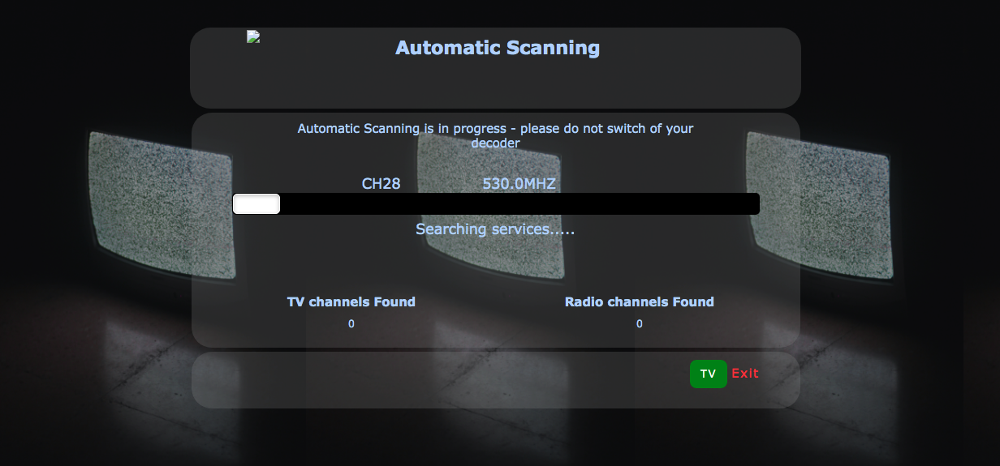

# Gotv loading page

## Process

I woke up in the middle of sunny sunday afternoon (16th of May 2021) and switched on my GOTV and tv set, whilst it was loading i had this thought i could clone/ redesigned the loading page to hone my frontend skill. I spent ridiculous amount of time on the styling Mobile view, we all know how CSS is capable to render our life useless, at the same time fun.

furthermore, I created a script file to get my hands dirty on the JavaScript. It was pretty confuse as usual and I was skeptical on how I could name the function 'Move()' or 'load()', I decided to sit on 'Move' because I love the fact it simply means going forward which is self explanatory.

## Link

- [Live](https://brymmobaggins.github.io/gotv-loading-page/)

### Built with
  
- Semantic HTML5
- CSS
- flexbox
- Vanilla Javascript
  
## Resources

[W3school](https://www.w3school.com) This helped in styling my custom progress bar,I was pretty lost at some point.
[Unsplash](https://www.unsplash.com) I was a bit indecisive to choose background images on the internet. I navigated to unsplash and it helps to make my rightful decision which i really love.

 